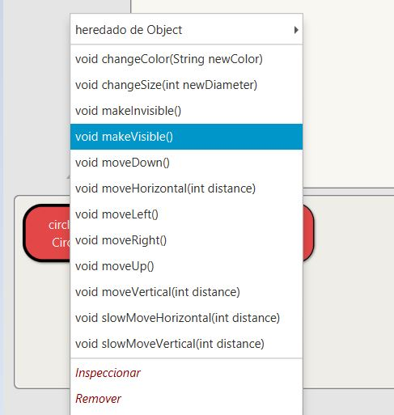
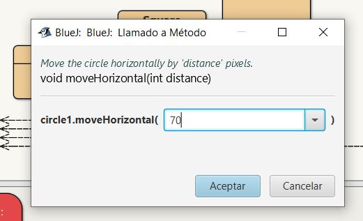
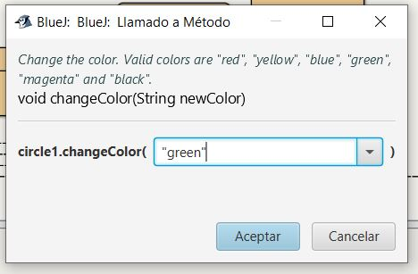
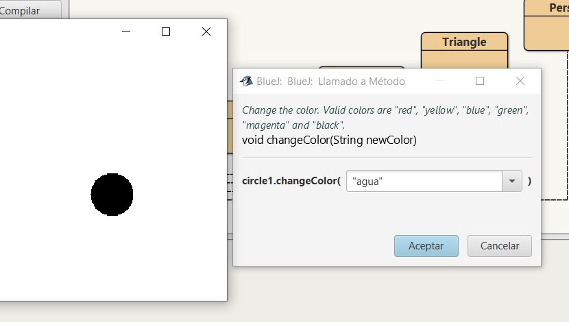
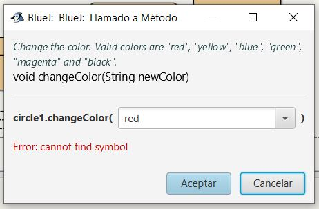
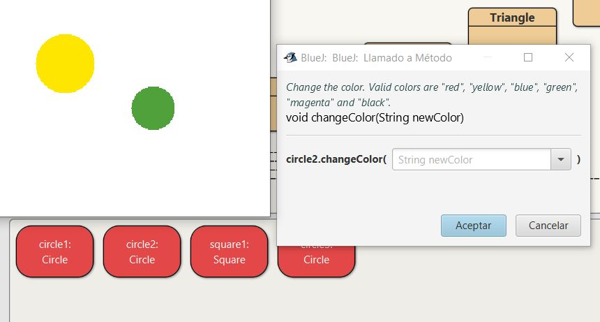
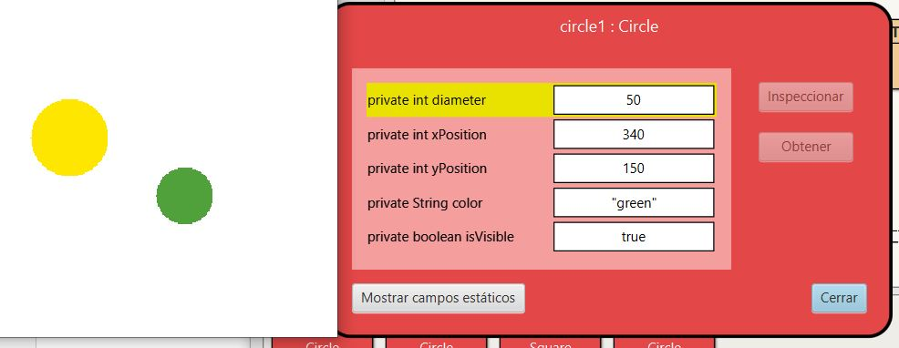
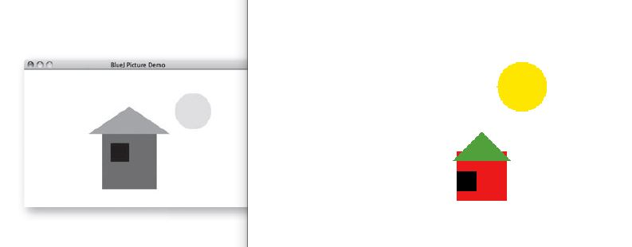

## Unidad 1: Objetos y Clases

### Ejercicio 1.1: Creación de Instancias
En este ejercicio se practica la instanciación de objetos a partir de clases predefinidas (`Circle`, `Square`, `Triangle`). 

**Hitos logrados:**
* Creación de múltiples instancias de la clase `Circle`.
* Creación de una instancia de la clase `Square`.
* Interacción con el banco de objetos de BlueJ.

**Resultado visual:**

  

### Ejercicio 1.2: Interacción con Métodos y Estado
En este ejercicio se analiza cómo la llamada a métodos modifica los atributos internos de un objeto y su comportamiento visual.

**Hitos logrados:**
* **Persistencia del estado:** Al invocar `moveDown` varias veces, el objeto acumula el movimiento, confirmando que los objetos mantienen memoria de su posición actual.
* **Análisis de métodos sin retorno:** Se observa que `makeInvisible` cambia el estado de visibilidad; ejecutarlo una segunda vez no produce cambios adicionales porque el estado ya es "falso".
* **Manipulación directa:** Interacción con el banco de objetos de BlueJ para validar el comportamiento de la lógica de programación.

**Resultado visual:**

  

  
### Ejercicio 1.3: Parámetros y Modificación de Atributos
En este ejercicio se introduce el uso de parámetros para definir de forma precisa el comportamiento de los métodos sobre los objetos.

**Hitos logrados:**
* **Desplazamiento Variable:** Uso de `moveVertical` y `slowMoveVertical` para controlar la distancia exacta del movimiento.
* **Cálculo de Coordenadas:** Aplicación de valores negativos en `moveHorizontal` (ej: `-70`) para desplazar el objeto hacia la izquierda, comprendiendo el funcionamiento del plano cartesiano en el `Canvas`.
* **Escalabilidad:** Uso del método `changeSize` para modificar las dimensiones del objeto, alterando sus atributos de tamaño de forma dinámica.

**Resultado visual:**

  

### Ejercicios 1.4, 1.5 y 1.6: Parámetros de tipo String y Tipado
En esta sección se explora cómo pasar datos de tipo texto a los métodos y cómo Java reacciona ante errores de sintaxis o valores no definidos.

**Hitos logrados:**
* **Paso de argumentos (String):** Uso del método `changeColor` pasando cadenas entre comillas (ej: `"red"`, `"blue"`) para modificar el atributo de color del objeto.
* **Manejo de errores de lógica:** Al introducir un color no soportado (Ejercicio 1.5), se observa que el sistema no reconoce el valor, lo que en programación robusta requeriría una validación o manejo de excepciones.
* **Sintaxis y Tipado:** En el Ejercicio 1.6, se comprueba que al omitir las comillas, Java busca una variable con ese nombre en lugar de un valor de texto, provocando un error de compilación o ejecución.

**Resultado visual:**

  

  

  

### Ejercicio 1.7: Gestión Dinámica de Múltiples Objetos
En este ejercicio final de la sección, se integran todos los conceptos aprendidos para gestionar simultáneamente varios objetos con estados independientes.

**Hitos logrados:**
* **Instanciación masiva:** Creación de diversos objetos (`Circle`, `Square`, `Triangle`, `Person`) en el banco de objetos de BlueJ.
* **Personalización de atributos:** Configuración de un círculo grande amarillo y otro pequeño verde, practicando el paso de parámetros numéricos y de texto.
* **Control espacial:** Uso combinado de los métodos `move` para organizar las figuras en el `Canvas`, logrando una composición visual personalizada.

**Resultado visual:**

  

### Ejercicio 1.8: Inspección de Objetos y Estado Interno
Este ejercicio permite visualizar la relación directa entre los campos de un objeto (sus variables) y su representación en la interfaz gráfica.

**Hitos logrados:**
* **Uso del Inspector de Objetos:** Apertura de la ventana de inspección para monitorizar los valores de los atributos en tiempo real.
* **Sincronización de Datos:** Observación de cómo al invocar métodos de comportamiento (como `moveLeft`), los valores numéricos de las coordenadas en el inspector se actualizan instantáneamente.
* **Comprensión del Atributo:** Validación de que el "movimiento" no es más que la modificación de un dato numérico dentro de la memoria del objeto.

**Resultado visual:**

  

### Ejercicio 1.9: Composición de Escenas Complejas
En este ejercicio se aplica la lógica de objetos para recrear una composición visual específica, integrando múltiples instancias y coordinando sus estados individuales.

**Hitos logrados:**
* **Modelado y Abstracción:** Identificación de las formas geométricas necesarias (`Circle`, `Square`, `Triangle`, `Person`) para replicar la figura de referencia.
* **Algoritmo de Construcción:** Ejecución de una secuencia lógica de pasos: creación del objeto, cambio de visibilidad, ajuste de color, redimensionado y posicionamiento mediante coordenadas.
* **Análisis de Alternativas:** Verificación de que un mismo estado final puede alcanzarse mediante distintos caminos (ej: múltiples movimientos cortos frente a un único desplazamiento preciso), lo que demuestra la flexibilidad de la POO.

**Resultado visual:**

  

---
*Nota: Proyecto desarrollado como parte del Grado en Ingeniería Informática.*
---
*Nota: Proyecto desarrollado como parte del Grado en Ingeniería Informática.*
