## Unidad 1: Objetos y Clases

### Ejercicio 1.1: Creación de Instancias
En este ejercicio se practica la instanciación de objetos a partir de clases predefinidas (`Circle`, `Square`, `Triangle`). 

**Hitos logrados:**
* Creación de múltiples instancias de la clase `Circle`.
* Creación de una instancia de la clase `Square`.
* Interacción con el banco de objetos de BlueJ.

**Resultado visual:**

<div align="center">
  
</div>

### Ejercicio 1.2: Interacción con Métodos y Estado
En este ejercicio se analiza cómo la llamada a métodos modifica los atributos internos de un objeto y su comportamiento visual.

**Hitos logrados:**
* **Persistencia del estado:** Al invocar `moveDown` varias veces, el objeto acumula el movimiento, confirmando que los objetos mantienen memoria de su posición actual.
* **Análisis de métodos sin retorno:** Se observa que `makeInvisible` cambia el estado de visibilidad; ejecutarlo una segunda vez no produce cambios adicionales porque el estado ya es "falso".
* **Manipulación directa:** Interacción con el banco de objetos de BlueJ para validar el comportamiento de la lógica de programación.

**Resultado visual:**

<div align="center">
  
</div>

  
### Ejercicio 1.3: Parámetros y Modificación de Atributos
En este ejercicio se introduce el uso de parámetros para definir de forma precisa el comportamiento de los métodos sobre los objetos.

**Hitos logrados:**
* **Desplazamiento Variable:** Uso de `moveVertical` y `slowMoveVertical` para controlar la distancia exacta del movimiento.
* **Cálculo de Coordenadas:** Aplicación de valores negativos en `moveHorizontal` (ej: `-70`) para desplazar el objeto hacia la izquierda, comprendiendo el funcionamiento del plano cartesiano en el `Canvas`.
* **Escalabilidad:** Uso del método `changeSize` para modificar las dimensiones del objeto, alterando sus atributos de tamaño de forma dinámica.

**Resultado visual:**

<div align="center">
  
</div>


### Ejercicios 1.4, 1.5 y 1.6: Parámetros de tipo String y Tipado
En esta sección se explora cómo pasar datos de tipo texto a los métodos y cómo Java reacciona ante errores de sintaxis o valores no definidos.

**Hitos logrados:**
* **Paso de argumentos (String):** Uso del método `changeColor` pasando cadenas entre comillas (ej: `"red"`, `"blue"`) para modificar el atributo de color del objeto.
* **Manejo de errores de lógica:** Al introducir un color no soportado (Ejercicio 1.5), se observa que el sistema no reconoce el valor, lo que en programación robusta requeriría una validación o manejo de excepciones.
* **Sintaxis y Tipado:** En el Ejercicio 1.6, se comprueba que al omitir las comillas, Java busca una variable con ese nombre en lugar de un valor de texto, provocando un error de compilación o ejecución.

**Resultado visual:**

<div align="center">
  
</div>

<div align="center">
  
</div>

<div align="center">
  
</div>


### Ejercicio 1.7: Gestión Dinámica de Múltiples Objetos
En este ejercicio final de la sección, se integran todos los conceptos aprendidos para gestionar simultáneamente varios objetos con estados independientes.

**Hitos logrados:**
* **Instanciación masiva:** Creación de diversos objetos (`Circle`, `Square`, `Triangle`, `Person`) en el banco de objetos de BlueJ.
* **Personalización de atributos:** Configuración de un círculo grande amarillo y otro pequeño verde, practicando el paso de parámetros numéricos y de texto.
* **Control espacial:** Uso combinado de los métodos `move` para organizar las figuras en el `Canvas`, logrando una composición visual personalizada.

**Resultado visual:**

<div align="center">
  
</div>

### Ejercicio 1.8: Inspección de Objetos y Estado Interno
Este ejercicio permite visualizar la relación directa entre los campos de un objeto (sus variables) y su representación en la interfaz gráfica.

**Hitos logrados:**
* **Uso del Inspector de Objetos:** Apertura de la ventana de inspección para monitorizar los valores de los atributos en tiempo real.
* **Sincronización de Datos:** Observación de cómo al invocar métodos de comportamiento (como `moveLeft`), los valores numéricos de las coordenadas en el inspector se actualizan instantáneamente.
* **Comprensión del Atributo:** Validación de que el "movimiento" no es más que la modificación de un dato numérico dentro de la memoria del objeto.

**Resultado visual:**

<div align="center">
  
</div>

### Ejercicio 1.9: Composición de Escenas Complejas
En este ejercicio se aplica la lógica de objetos para recrear una composición visual específica, integrando múltiples instancias y coordinando sus estados individuales.

**Hitos logrados:**
* **Modelado y Abstracción:** Identificación de las formas geométricas necesarias (`Circle`, `Square`, `Triangle`, `Person`) para replicar la figura de referencia.
* **Algoritmo de Construcción:** Ejecución de una secuencia lógica de pasos: creación del objeto, cambio de visibilidad, ajuste de color, redimensionado y posicionamiento mediante coordenadas.
* **Análisis de Alternativas:** Verificación de que un mismo estado final puede alcanzarse mediante distintos caminos (ej: múltiples movimientos cortos frente a un único desplazamiento preciso), lo que demuestra la flexibilidad de la POO.

**Resultado visual:**

<div align="center">
  
</div>

## Ejercicio 1.10: Interacción entre Objetos
En este ejercicio se introduce el concepto de **comunicación entre objetos**, analizando cómo una instancia de una clase puede coordinar y enviar mensajes a otras instancias para realizar una tarea compleja.

**Hitos logrados:**
* **Análisis de Dependencias:** Identificación de que el proyecto `house` utiliza las clases base (`Circle`, `Square`, `Triangle`) para construir una entidad de mayor nivel.
* **Invocación de Métodos Externa:** Comprensión de que el usuario no necesita mover cada pieza individualmente; el objeto "coordinador" asume esa responsabilidad.
* **Abstracción:** Observación de cómo la complejidad de posicionar y colorear múltiples figuras se oculta tras un único método simplificado.

**Concepto Clave (Invocación de métodos):**
Los objetos pueden comunicarse entre sí invocando métodos de otros objetos. En un programa real, esto permite que miles de objetos interactúen de forma jerárquica o colaborativa.

**Resultado visual:**
<div align="center">
  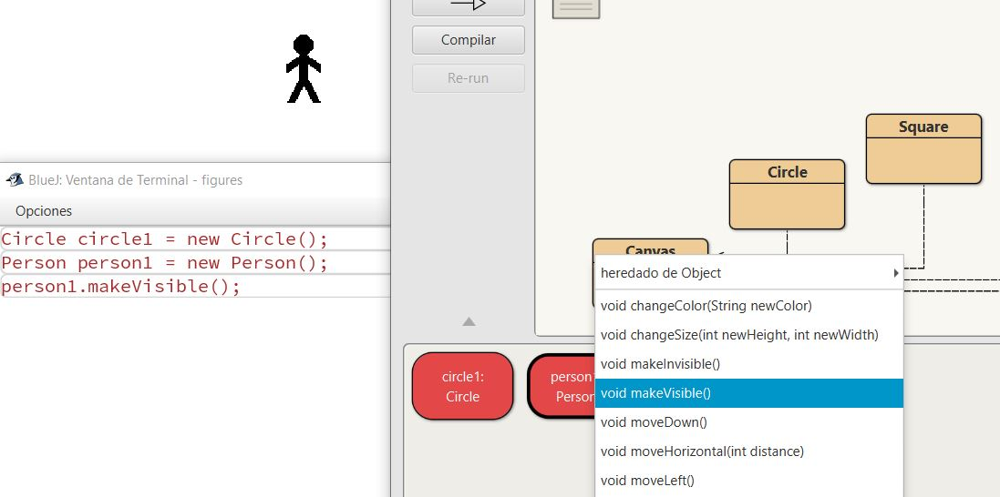
</div>

## Ejercicio 1.11: Inspección de Objetos (El Inspector)
Uso de la herramienta de inspección para analizar el **estado interno** de un objeto en tiempo real, visualizando sus campos y valores actuales.

**Hitos logrados:**
* **Visualización de Atributos:** Uso de la función "Inspect" para abrir la ventana de estado del objeto.
* **Identificación de Campos (Fields):** Observación de las variables internas que definen al objeto: `xPosition`, `yPosition`, `color`, `width` y `isVisible`.
* **Estado vs. Representación:** Comprobación de que cada objeto en el banco de objetos tiene sus propios valores independientes, aunque pertenezcan a la misma clase.

**Concepto Clave (Estado):**
El conjunto de valores de todos los atributos de un objeto en un momento determinado se denomina **estado**. El Inspector permite auditar este estado sin necesidad de ver el código fuente.

**Resultado visual:**
<div align="center">
  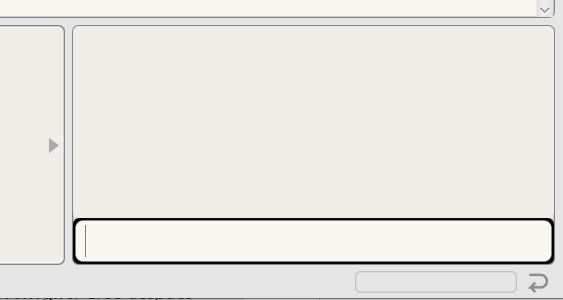
</div>

## Ejercicio 1.12: Actualización Dinámica del Estado
Análisis del impacto de la invocación de métodos sobre los atributos internos del objeto mediante el seguimiento en el Inspector.

**Hitos logrados:**
* **Sincronización Acción-Estado:** Verificación de que al invocar métodos de movimiento (ej. `moveRight`), los valores de `xPosition` en el Inspector se actualizan automáticamente.
* **Validación de Lógica Interna:** Observación de cómo métodos de cambio de estado (como `makeVisible` o `changeColor`) alteran los valores booleanos y de cadena de texto (`String`) del objeto.
* **Persistencia de Datos:** Confirmación de que el objeto "recuerda" su nuevo estado tras la ejecución del método, manteniendo los cambios de forma permanente en memoria hasta la siguiente instrucción.

**Concepto Clave (Mutación de Estado):**
La ejecución de un método a menudo tiene como objetivo "mutar" (cambiar) el estado del objeto. Este ejercicio demuestra que la interfaz gráfica es solo una representación visual de los datos numéricos y lógicos almacenados en los campos del objeto.

**Resultado visual:**
<div align="center">
  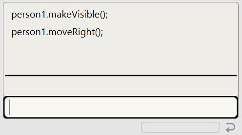
</div>

## Ejercicio 1.13: Instanciación de Clases Complejas
Práctica de creación de objetos de alto nivel que integran múltiples componentes para formar una escena completa.

**Hitos logrados:**
* **Instanciación de `Picture`:** Creación de un objeto que no es una figura geométrica simple, sino un coordinador de estas.
* **Automatización con `draw()`:** Invocación del método principal para renderizar la imagen de la casa de forma programada.
* **Control de Apariencia:** Experimentación con los métodos `setBlackAndWhite` y `setColor` para observar cómo un solo mensaje al objeto "padre" se propaga a todos sus "hijos" (las figuras).

**Resultado visual:**
<div align="center">
  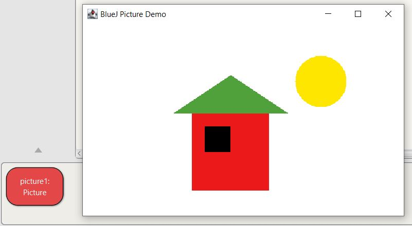
</div>

## Ejercicio 1.14: Análisis de la Lógica de Composición
Reflexión técnica sobre la implementación interna de la clase `Picture` y la gestión de sub-objetos.

**Hitos logrados:**
* **Arquitectura de Software:** Deducción de que `Picture` no "dibuja" píxeles, sino que posee (contiene) instancias de otras clases (`Square`, `Triangle`, `Circle`).
* **Secuenciación de Mensajes:** Comprensión de que el dibujo final es el resultado de una lista ordenada de instrucciones: crear figuras, posicionarlas, redimensionarlas y darles color.
* **Encapsulamiento:** Reconocimiento de que la complejidad de la construcción de la imagen está "oculta" dentro del código de la clase, permitiendo al usuario obtener el resultado con un solo clic.

**Concepto Clave (Composición):**
La composición es una relación entre clases donde una clase (el "todo") utiliza objetos de otras clases (las "partes") como sus propios atributos. Es el principio de "un objeto tiene un...".


## Ejercicio 1.15: Inspección del Código Fuente
Transición de la manipulación visual al análisis del código escrito en lenguaje Java.

**Hitos logrados:**
* **Acceso al Editor:** Apertura del editor de BlueJ para examinar la definición de la clase `Circle`.
* **Identificación de la Firma de la Clase:** Localización de la línea `public class Circle`, que define el nombre y la visibilidad de la clase.
* **Reconocimiento de Estructura:** Distinción visual entre las tres secciones principales de un archivo Java:
    1. **Campos (Fields):** Donde se definen los atributos (ej. `private int diameter`).
    2. **Constructores:** Donde se inicializa el objeto.
    3. **Métodos:** Donde se define el comportamiento (ej. `public void moveRight()`).

**Concepto Clave (Código Fuente):**
El código fuente es el conjunto de instrucciones escritas en un lenguaje de programación (Java) que definen cómo se comportará una clase y qué datos almacenará. Es el "plano" técnico del objeto.

**Resultado visual:**
<div align="center">
  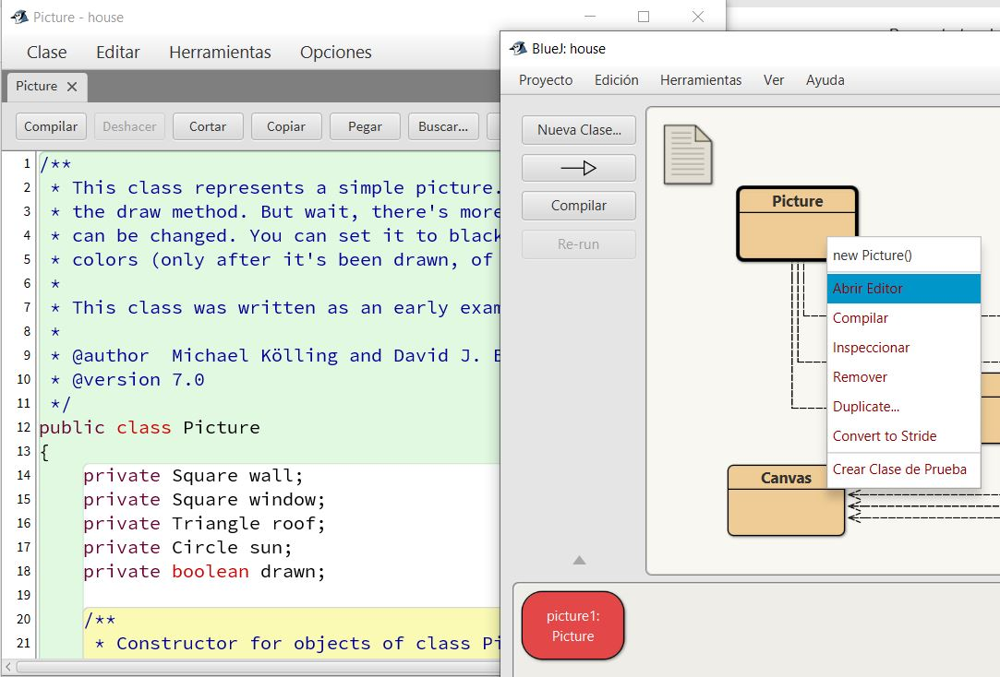
</div>


## Ejercicio 1.16: Identificación de Atributos (Campos)
Análisis de la sección de campos de una clase para comprender cómo se almacena la información del estado.

**Hitos logrados:**
* **Localización de variables:** Identificación de los campos en la parte superior del archivo fuente de la clase `Circle`.
* **Sintaxis de Declaración:** Observación de la estructura `private tipo nombre;` (ej. `private int xPosition;`).
* **Estado Interno:** Comprensión de que estos campos son los mismos que se visualizaban anteriormente a través de la herramienta *Inspector*.

**Resultado visual:**
<div align="center">
  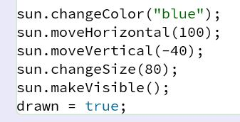
</div>

## Ejercicio 1.17: Análisis de Tipos de Datos en Java
Estudio de la tipificación de variables para entender la naturaleza de la información que el objeto puede procesar.

**Hitos logrados:**
* **Tipos Numéricos (`int`):** Reconocimiento de que las coordenadas y tamaños se almacenan como números enteros.
* **Tipos de Texto (`String`):** Identificación de que el color se gestiona como una cadena de caracteres.
* **Encapsulamiento Inicial:** Observación de la palabra clave `private`, que indica que los datos están protegidos y solo pueden ser modificados a través de los métodos de la clase.

**Concepto Clave (Tipado Estático):**
A diferencia de Python (donde las

**Resultado visual:**
<div align="center">
  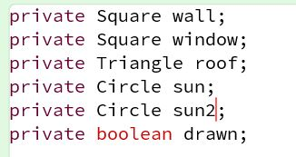
</div>


## Ejercicio 1.18: Estructura y Nomenclatura de Métodos
Análisis de la sección de métodos para identificar las acciones disponibles y su convención de nombres.

**Hitos logrados:**
* **Identificación de Métodos:** Localización de bloques como `public void moveRight()` en el código fuente.
* **Convención CamelCase:** Observación de cómo los nombres de los métodos en Java comienzan en minúscula y capitalizan las palabras siguientes (ej. `makeVisible`), facilitando la legibilidad.
* **Relación Firma-Acción:** Comprensión de que el nombre del método suele ser un verbo que describe fielmente la transformación que sufrirá el estado del objeto.

**Resultado visual:**
<div align="center">
  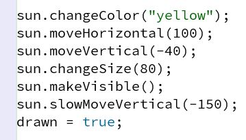
</div>


## Ejercicio 1.19: El Tipo de Retorno (void)
Estudio de la cabecera del método para entender si una acción devuelve información o simplemente la ejecuta.

**Hitos logrados:**
* **Concepto de `void`:** Reconocimiento de que la palabra clave `void` significa que el método realiza una acción (como mover una figura) pero no devuelve ningún valor como resultado al invocador.
* **Métodos de Acción:** Identificación de que la mayoría de los métodos de control visual (`move`, `changeColor`, `draw`) son de tipo `void`.
* **Diferenciación Técnica:** Comprensión de que, a diferencia de una función matemática que devuelve un resultado, un método `void` se centra en cambiar el estado interno (efecto colateral).

**Concepto Clave (Firma del Método):**
La firma del método define su visibilidad (`public`), su tipo de retorno (`void`, `int`, `String`), su nombre y sus parámetros. Es el "contrato" que indica cómo interactuar con el objeto.

**Resultado visual:**
<div align="center">
  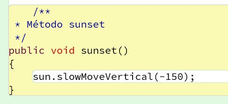
</div>


## Ejercicio 1.20: Parámetros en el Código Fuente
Análisis de cómo se declaran y reciben los datos externos dentro de la cabecera de los métodos.

**Hitos logrados:**
* **Identificación de Parámetros:** Localización de variables dentro de los paréntesis de un método, como `(int distance)` en `moveHorizontal`.
* **Declaración de Tipo:** Observación de que cada parámetro debe tener un tipo definido (ej. `int` para números, `String` para colores).
* **Flujo de Datos:** Comprensión de cómo el valor pasado durante la invocación se asigna a la variable del parámetro para ser usado dentro del cuerpo del método.

**Resultado visual:**
<div align="center">
  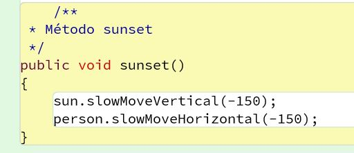
</div>


## Ejercicio 1.21: Modificación del Estado Inicial
Primera intervención directa en el código fuente para alterar el comportamiento predeterminado de un objeto mediante su constructor.

**Hitos logrados:**
* **Edición del Constructor:** Localización del bloque `public Circle()` y modificación del valor asignado al campo `color`.
* **Persistencia del Cambio:** Verificación de que, tras la modificación, cada instancia nueva del objeto nace con el nuevo color definido (ej. de "blue" a "red").
* **Introducción al Ciclo de Desarrollo:** Comprensión de que los cambios en el código fuente definen las "reglas del juego" para todos los objetos futuros de esa clase.

**Resultado visual:**
<div align="center">
  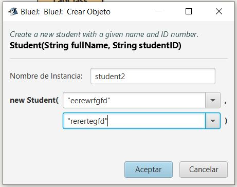
</div>

## Ejercicio 1.22: Errores de Sintaxis y Depuración
Experimentación con la rigidez sintáctica de Java y la respuesta del compilador ante errores.

**Hitos logrados:**
* **Provocación de Errores:** Introducción deliberada de fallos (eliminar un punto y coma `;` o una llave `{`) para observar la reacción de BlueJ.
* **Lectura de Mensajes de Error:** Interpretación de las notificaciones en la barra de estado (ej. "';' expected").
* **Sensibilidad a las Reglas:** Comprensión de que el código fuente debe ser sintácticamente perfecto para que la máquina pueda procesarlo.

**Resultado visual:**
<div align="center">
  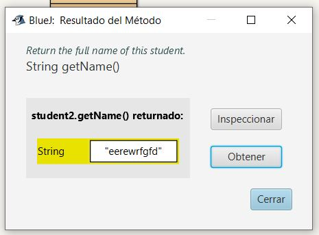
</div>


## Ejercicio 1.23: El Proceso de Compilación
Estudio del mecanismo que transforma el código fuente (texto legible por humanos) en código máquina ejecutable por la JVM.

**Hitos logrados:**
* **Uso del Botón Compile:** Ejecución del proceso de traducción del archivo `.java` tras realizar cambios.
* **Estado de la Clase:** Observación de cómo la apariencia de la clase en el diagrama de BlueJ cambia (de rayado a sólido) una vez compilada con éxito.
* **Vinculación Código-Objeto:** Validación de que no es posible crear nuevas instancias de una clase si el código fuente contiene errores o no ha sido compilado.

**Concepto Clave (Compilación):**
A diferencia de Python, Java requiere un paso intermedio donde un programa (el compilador) revisa todo el código en busca de errores antes de permitir su ejecución. Si el código no compila, el programa "no existe" para el ordenador.

**Resultado visual:**
<div align="center">
  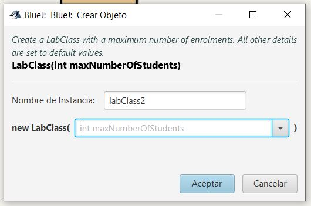
</div>


## Ejercicio 1.24: Ajuste de Parámetros de Posición
Modificación de las coordenadas iniciales de los componentes para reestructurar la escena visual.

**Hitos logrados:**
* **Control de Coordenadas:** Modificación de los valores de `xPosition` y `yPosition` en el constructor de la clase `Circle` (el sol).
* **Posicionamiento Relativo:** Ajuste de la ubicación del sol para que se desplace a una posición específica en el lienzo (ej. la esquina superior derecha).
* **Validación de Cambios:** Uso del ciclo "Modificar -> Compilar -> Instanciar" para verificar el nuevo punto de origen del objeto.

**Resultado visual:**
<div align="center">
  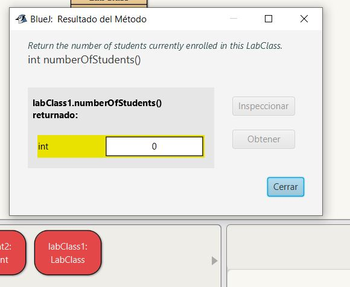
</div>


## Ejercicio 1.25: Modificación de Atributos de Dimensión
Personalización de la escala de los objetos mediante la alteración de sus campos de tamaño en el código fuente.

**Hitos logrados:**
* **Alteración de Escala:** Cambio de los valores de `diameter` en el círculo y `height`/`width` en los cuadrados.
* **Proporcionalidad:** Comprensión de cómo el cambio de tamaño afecta a la estética general de la escena (`Picture`) y la necesidad de reajustar posiciones tras cambiar dimensiones.

**Resultado visual:**
<div align="center">
  
</div>


## Ejercicio 1.26: Invocación de Métodos en el Constructor
Análisis de cómo un objeto puede realizar acciones automáticas en el momento exacto de su nacimiento.

**Hitos logrados:**
* **Automatización Inicial:** Observación de cómo el constructor de `Picture` llama a métodos como `makeVisible()` automáticamente.
* **Encapsulamiento de Acciones:** Comprensión de que el constructor no solo asigna datos (estado), sino que también puede disparar comportamientos (acciones) para que el objeto esté listo para el usuario desde el segundo cero.

**Concepto Clave (Constructor):**
El constructor es un método especial que tiene el mismo nombre que la clase. Su función es asegurar que, al crear el objeto, este tenga un estado válido y realice las acciones iniciales necesarias (como hacerse visible).

**Resultado visual:**
<div align="center">
  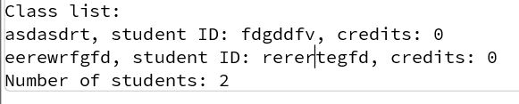
</div>


## Ejercicio 1.27: Ampliación de la Composición (El segundo Sol)
Práctica de declaración y creación de múltiples instancias de una misma clase dentro de un objeto contenedor.

**Hitos logrados:**
* **Declaración de Variables:** Inclusión de un segundo objeto de tipo `Circle` en los campos de la clase `Picture` (ej. `private Circle sun2;`).
* **Instanciación Múltiple:** Creación del nuevo objeto en el constructor mediante la palabra clave `new`.
* **Diferenciación de Estado:** Configuración del segundo sol con una posición y color distintos al original, demostrando que cada instancia mantiene su propia identidad.

**Resultado visual:**
<div align="center">
  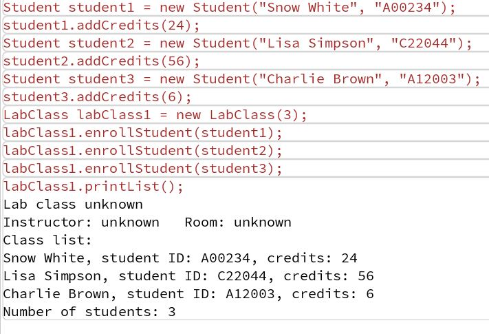
</div>


## Ejercicio 1.28: Gestión de Visibilidad en Cascada
Análisis de la propagación de mensajes desde el objeto coordinador a todos sus componentes.

**Hitos logrados:**
* **Invocación Colectiva:** Modificación del método `draw()` para incluir la llamada a `sun2.makeVisible()`.
* **Consistencia Visual:** Verificación de que, al añadir un nuevo objeto, se deben actualizar todos los métodos de control de la clase para mantener la coherencia (si la casa se oculta, ambos soles deben ocultarse).

**Resultado visual:**
<div align="center">
  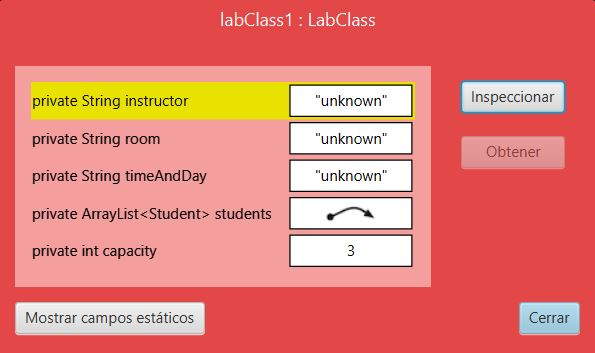
</div>

## Ejercicio 1.29: Implementación de Nuevos Métodos (setBlackAndWhite)
Estudio de la lógica de transformación masiva de estado a través de un solo comando.

**Hitos logrados:**
* **Delegación de Tareas:** Análisis de cómo el método
* 
**Resultado visual:**
<div align="center">
  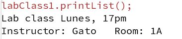
</div>

## Ejercicio 1.32
**¿Qué habría que hacer para añadir un nuevo campo, por ejemplo uno denominado `name` a un objeto círculo?**

Para añadir un nuevo campo a un objeto, es necesario **modificar la definición de su clase**. En el código fuente de la clase `Circulo`, se debe declarar la variable de instancia (atributo):

```java
private String name;
```
## Ejercicio 1.33
**Escriba la signatura de un método denominado 'send' que tenga un parámetro de tipo String y no devuelva ningún valor.**

```java
void send(String message)
```

## Ejercicio 1.34
**scriba la cabecera de un método denominado 'average' que tenga dos parámetros, ambos de tipo 'int', y devuelva un valor de tipo int.**

```java
void send(String message)
```


---
*Nota: Proyecto desarrollado como parte del Grado en Ingeniería Informática.*
